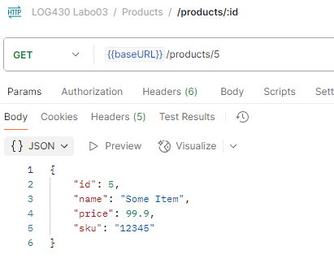
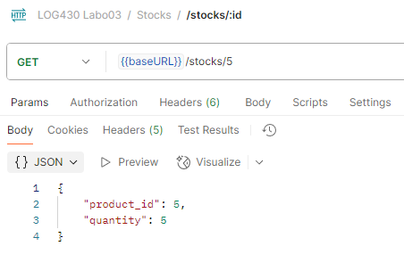
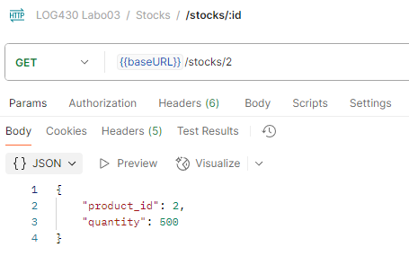
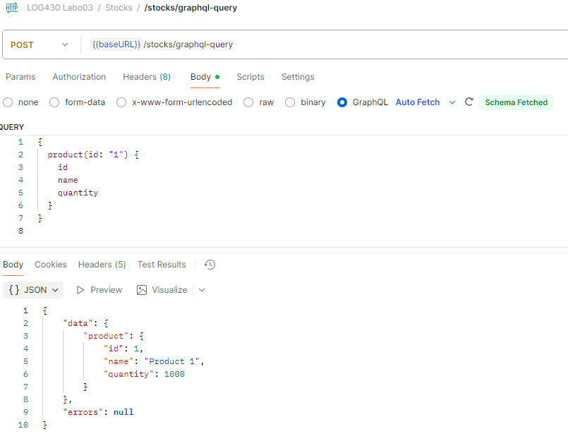
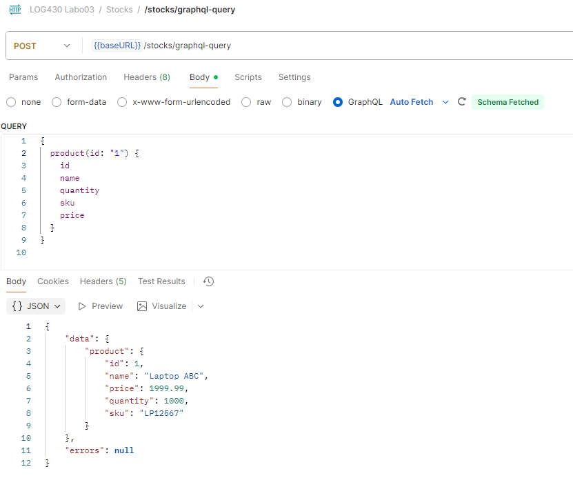

# Labo 03 — Rapport

 \
Kevin Miranda Carrillo \
Rapport de laboratoire \
LOG430 — Architecture logicielle \
Montréal le 1 octobre 2025 \
École de technologie supérieure

## Questions

### Question 1: Question 1 : Quel nombre d'unités de stock pour votre article avez-vous obtenu à la fin du test ? Et pour l'article avec `id=2` ? Veuillez inclure la sortie de votre Postman pour illustrer votre réponse.

À la fin du test, j'ai obtenu 5 unités de stock pour l'article créer lors des tests, dû au fait que j'ai réalisé l'étape extra (la suppression de la commande).

On peut voir qu'a l'initialisation de la bd MySQL, les ids des articles vont de 1 à 4, on peut donc supposer que l'article que j'ai créé a l'id 5. On peut aussi voir que l'article avec id=2 a 500 unités en stock. Mais on pourra vérifier cela en faisant une requête GET dans Postman.
```sql
-- Mock data: product stocks
INSERT INTO stocks (product_id, quantity) VALUES
(1, 1000),
(2, 500),
(3, 2),
(4, 90);
```

On peut voir dans mon test que la quantité finale de l'article que j'ai créé devrait être 5:
```py
# 6. Étape extra: supprimez la commande et vérifiez le stock de nouveau. Le stock devrait augmenter après la suppression de la commande.
    response_delete_order = client.delete(f'/orders/{order_id}')
    delete_result = response_delete_order.get_json()
    assert delete_result['deleted'] == True
    response_get_stocks_after_delete = client.get(f'/stocks/{product_id}')
    assert response_get_stocks_after_delete.status_code == 201
    stock_data_after_delete = response_get_stocks_after_delete.get_json()
    assert stock_data_after_delete['product_id'] == product_id
    assert stock_data_after_delete['quantity'] == 5 # Devrait revenir à 5
```

Avec une requête GET dans Postman, on peut commencer par vérifier que l'article que j'ai ajouté a bien l'id 5 si on compare les informations avec ce qui a été ajouté dans le test:
```python
# 1. Créez un article (`POST /products`)
    product_data = {'name': 'Some Item', 'sku': '12345', 'price': 99.90}
    response = client.post('/products',
                          data=json.dumps(product_data),
                          content_type='application/json')
```


On peut donc aller vérifier le stock de l'article avec id=5:



On voit que l'article avec id=5 a bien 5 unités en stock, ce qui est correct. Maintenant, on peut aller vérifier le stock de l'article avec id=2:



### Question 2: Décrivez l'utilisation de la méthode join dans ce cas. Utilisez les méthodes telles que décrites à `Simple Relationship Joins` et `Joins to a Target with an ON Clause` dans la documentation SQLAlchemy pour ajouter les colonnes demandées dans cette activité. Veuillez inclure le code pour illustrer votre réponse.

Pour ajouter les colonnes `name`, `sku` et `price` de l'article dans le rapport de stock, j'ai utilisé la méthode `join` de SQLAlchemy pour joindre les tables `Stock` et `Product`. La relation entre ces deux tables est basée sur la clé étrangère `product_id` dans la table `Stock`, qui fait référence à la colonne `id` dans la table `Product`. J'ai aussi modifié la sélection des colonnes dans la requête pour inclure les nouvelles colonnes demandées.
Voici comment j'ai modifié la méthode `get_stock_for_all_products` dans `read_stock.py` pour inclure les colonnes supplémentaires:

```python
def get_stock_for_all_products():
    """Get stock quantity for all products"""
    session = get_sqlalchemy_session()
    # TODO: ajoutez un join avec Product
    results = session.query(
        Stock.product_id,
        Stock.quantity,
        Product.name,
        Product.sku,
        Product.price,
    ).join(Product, Stock.product_id==Product.id).all()
    stock_data = []
    for row in results:
        print(row)
    for row in results:
        stock_data.append({
            'Article': row.product_id,
            'Nom': row.name,
            'Numéro SKU': row.sku,
            'Prix unitaire': row.price,
            'Unités en stock': int(row.quantity),
        })
    
    return stock_data
```

J'ai utilisé la méthode join telle qu'indiqué à `Joins to a Target with an ON Clause` dans la documentation SQLAlchemy. La clause `Stock.product_id==Product.id` spécifie la condition de jointure entre les deux tables. Cela permet de récupérer les informations de la table `Product` pour chaque enregistrement dans la table `Stock` et les inclure dans la requête à MySQL.

### Question 3:  Quels résultats avez-vous obtenus en utilisant l’endpoint `POST /stocks/graphql-query` avec la requête suggérée ? Veuillez joindre la sortie de votre requête dans Postman afin d’illustrer votre réponse

En me servant de la requête se retrouvant déjà dans la collection Postman fournie, j'ai obtenu l'id du produit spécifié dans la requête (le produit avec id=1) ainsi que le nom et la quantité en stock de ce produit. Voici la requête utilisée:

```graphql
{
  product(id: "1") {
    id
    name
    quantity
  }
}
```

Cette requête nous permet de récupérer uniquement les champs `id`, `name` et `quantity` du produit avec l'id 1. Voici la sortie obtenue dans Postman:



### Question 4: Quelles lignes avez-vous changé dans `update_stock_redis`? Veuillez joindre du code afin d’illustrer votre réponse.
Pour ajouter les colonnes `name`, `sku` et `price` dans Redis, j'ai dû créer une connexion vers MySQL pour récuperer l'information de chaque produit. J'ai utilisé une jointure pour récupérer les informations supplémentaires de la table `Product` et les ai incluses dans le dictionnaire que j'enregistre dans Redis. Voici les modifications apportées à la méthode `update_stock_redis` dans `write_stock.py`:

```python
def update_stock_redis(order_items, operation):
    """ Update stock quantities and product information in Redis """
    if not order_items:
        return
    r = get_redis_conn()
    stock_keys = list(r.scan_iter("stock:*"))
    session = get_sqlalchemy_session()
    try:
        if stock_keys:
            pipeline = r.pipeline()
            for item in order_items:
                if hasattr(item, 'product_id'):
                    product_id = item.product_id
                    quantity = item.quantity
                else:
                    product_id = item['product_id']
                    quantity = item['quantity']

                # Récupérer les infos produit
                product = session.query(Product).filter_by(id=product_id).first()
                current_stock = r.hget(f"stock:{product_id}", "quantity")
                current_stock = int(current_stock) if current_stock else 0

                if operation == '+':
                    new_quantity = current_stock + quantity
                else:
                    new_quantity = current_stock - quantity

                # Ajout des infos supplémentaires dans Redis
                pipeline.hset(
                    f"stock:{product_id}",
                    mapping={
                        "quantity": new_quantity,
                        "name": product.name if product else "",
                        "sku": product.sku if product else "",
                        "price": float(product.price) if product else 0.0
                    }
                )
            pipeline.execute()
        else:
            _populate_redis_from_mysql(r)
    finally:
        session.close()
```

Cependant, ce n'est pas la seule modification que j'ai dû faire dans la gestion des données dans Redis. J'ai aussi dû modifier la méthode `_populate_redis_from_mysql` pour inclure les nouvelles informations lors de la population initiale de Redis. Voici les modifications apportées à cette méthode:

```python
def _populate_redis_from_mysql(redis_conn):
    """ Helper function to populate Redis from MySQL stocks table """
    session = get_sqlalchemy_session()
    try:
        stocks = session.execute(
            text('''
                 SELECT product_id, quantity, name, sku, price FROM stocks
                     JOIN products ON stocks.product_id = products.id
            ''')
        ).fetchall()

        if not len(stocks):
            print("Il n'est pas nécessaire de synchronisér le stock MySQL avec Redis")
            return
        
        pipeline = redis_conn.pipeline()
        
        for product_id, quantity, name, sku, price in stocks:
            pipeline.hset(
                f"stock:{product_id}", 
                mapping={
                    "quantity": quantity,
                    "name": name,
                    "sku": sku,
                    "price": float(price)
                }
            )
        
        pipeline.execute()
        print(f"{len(stocks)} enregistrements de stock ont été synchronisés avec Redis")
        
    except Exception as e:
        print(f"Erreur de synchronisation: {e}")
        raise e
    finally:
        session.close()
```

Ensuite, j'ai dû modifier le type `Product` dans `schemas/product.py` pour inclure les nouvelles colonnes `name`, `sku` et `price`. Voici les modifications apportées:

```python
class Product(ObjectType):
    id = Int()
    name = String()
    quantity = Int()
    sku = String()
    price = Float()
```

Finalement, j'ai dû modifier la méthode `resolve_product` dans `query.py` pour inclure les nouvelles colonnes dans la réponse GraphQL. Voici les modifications apportées:

```python
    def resolve_product(self, info, id):
        """ Create an instance of Product based on stock info for that product that is in Redis """
        redis_client = get_redis_conn()
        product_data = redis_client.hgetall(f"stock:{id}")
        # TODO: ajoutez les colonnes name, sku, price
        if product_data:
            return Product(
                id=id,
                name=product_data['name'],
                quantity=int(product_data['quantity']),
                sku=product_data['sku'],
                price=float(product_data['price']),
            )
        return None
```

### Question 5: Quels résultats avez-vous obtenus en utilisant l’endpoint `POST /stocks/graphql-query` avec les améliorations ? Veuillez joindre la sortie de votre requête dans Postman afin d’illustrer votre réponse.

En utilisant toutes les ajouts indiqués dans la question précédente, j'ai pu interroger les nouvelles colonnes `name`, `sku` et `price` via l'endpoint GraphQL. Voici la requête que j'ai utilisée dans Postman:

```graphql
{
  product(id: "1") {
    id
    name
    quantity
    sku
    price
  }
}
```

Voici la sortie obtenue dans Postman après avoir effectué la requête:


### Question 6:  Examinez attentivement le fichier `docker-compose.yml` du répertoire `scripts`, ainsi que celui situé à la racine du projet. Qu’ont-ils en commun ? Par quel mécanisme ces conteneurs peuvent-ils communiquer entre eux ? Veuillez joindre du code YML afin d’illustrer votre réponse.

## Observations additionnelles

- Observations sur d’éventuels problèmes de setup ou de code rencontrés lors de l’exécution des activités (optionel).

    Mon plus gros problème de code a été la synchronisation de redis, la synchronisation ne se faisait pas intialement, j'ai dû ajouter le script 
- Particularités de votre configuration CI/CD (ex. : utilisation d’une VM, d’un service infonuagique comme Azure, etc.).

    J'utilise un self-hosted GitHub Actions runner sur la VM fournie lors du labo0. Le workflow du CI exécute automatiquement les tests sur chaque push/PR vers main, et le workflow du CD déploie l'application dans un conteneur Docker uniquement lors des push vers main.
